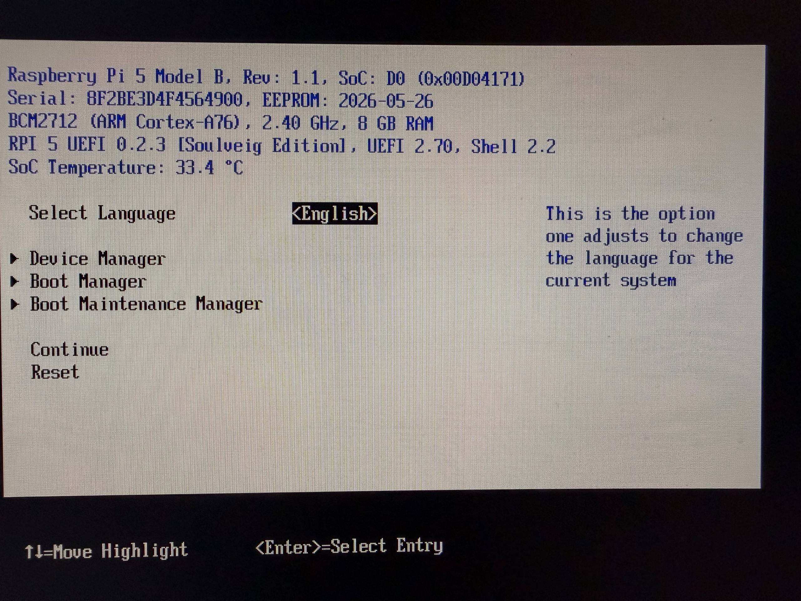

# Raspberry Pi 5 8GB UEFI [Soulveig Edition]

[English](#english) | [Русский](#русский) | [Releases](https://github.com/Soulveig/rpi5-uefi-soulveig-edition/releases)

## Screenshots / Скриншоты

<table>
  <tr>
    <td width="25%"></td>
    <td width="25%"></td>
    <td width="25%"></td>
    <td width="25%"></td>
  </tr>
  <tr>
    <td align="center">Cooling Fan menu / Меню Cooling Fan</td>
    <td align="center">Automatic, Manual and Manual Persistent modes / Режимы управления</td>
    <td align="center">Manual Persistent warning / Предупреждение режима Manual Persistent</td>
    <td align="center">SoC temperature / Температура SoC</td>
  </tr>
</table>

## English

UEFI firmware for Raspberry Pi 5, tested with VMware ESXi Arm and a Waveshare PoE HAT (F) Rev1.2 with one three-wire fan.

### Key changes

1. **BCM54213 for ESXi network ACPI**
2. **Fan Control for Waveshare PoE HAT (F) Rev1.2**
3. **UEFI microSD Card CRC Error fix**
4. **Release-aware SMBIOS BIOS version**
5. **SoC temperature on the UEFI main screen**
6. **Board revision, SoC stepping, serial number, EEPROM date, CPU, RAM and UEFI/Shell versions on the main screen**

Ready-to-use image: [`firmware/RPI_EFI.fd`](firmware/RPI_EFI.fd). GitHub Releases use the same required filename: `RPI_EFI.fd`.

Version 0.2.3 uses automatic Device Tree selection and has been boot-tested on Raspberry Pi 5 boards reporting both BCM2712 C1 and D0. It is not a D0-only image.

### Validation status

| Capability | Status | Scope |
|---|---|---|
| UEFI boot | **Verified** | Raspberry Pi 5 boards reporting BCM2712 C1 and D0 |
| Keyboard and boot-disk operation | **Verified** | Tested UEFI/ESXi boot media |
| ESXi Arm boot | **Verified** | ESXi Arm 8.0U3c build 24449057 |
| Automatic fan control | **Verified** | Waveshare PoE HAT (F) Rev1.2 |
| ESXi automatic fan control | **Verified** | `FANC` / `RPI0003` with rpitherm 0.5.0-3 |
| Manual fan speeds | **Verified** | Distinguishable PWM speed levels |
| Manual Persistent at 100% | **Verified** | Fan remains active after ESXi startup |
| microSD access from UEFI | **Verified with cold-boot caveat** | C1 detected the card immediately in the initial test; two D0 boards required one warm reset |
| UEFI setting persistence | **Verified** | Settings survive reboot and complete power removal after a normal reset/boot path |
| SoC temperature display | **Verified** | BCM2712 temperature is shown on the UEFI main screen and refreshes when the screen is reopened |
| RP1 Ethernet ACPI resources | **Verified** | `RPI0001` GEM plus separate `RPI0002` GPIO diagnostics |
| Sustained RX and TX | **Verified** | Separate experimental `RP1_GEM` ESXi driver on this ACPI layout |

The firmware exposes the hardware resources required by the ESXi driver. Packet processing itself is implemented by the separate experimental ESXi driver, not by UEFI.

### Improvements

#### Network

- preserves the working RP1 Ethernet ACPI layout from the tested v0.8 build;
- exposes the GEM controller as `RPI0001`, with one `RP1_ETH_BASE` MMIO range of `0x10000` bytes and an interrupt;
- exposes the diagnostic GPIO range as a separate `RPI0002` device, with an `RP1_IO_BANK0_BASE` range of `0x30000` bytes;
- keeps the fan implementation isolated from Ethernet: it does not modify Ethernet ACPI, Ethernet clocks, GPIO32, GEM, or PHY logic.

The firmware also exposes `FANC` / `RPI0003` with narrow mailbox, clock, PWM1,
GPIO45 and pad resources for the ESXi `rpitherm` driver. This device has no
interrupt resource and does not expose the shared RP1 interrupt 261.

This is the ACPI foundation used by the experimental RP1 Ethernet driver for ESXi, not a universal UEFI network driver. Sustained RX and TX were verified with the separate `RP1_GEM` ESXi driver; that result is specific to the tested firmware, driver and host configuration.

#### Fan control

Three modes are available in the platform settings menu:

`Device Manager → Raspberry Pi Configuration → Cooling Fan`

- **Automatic** — automatic fan curve based on SoC temperature;
- **Manual (0–100%)** — the selected speed remains active until control is handed over to the operating system;
- **Manual Persistent (0–100%)** — UEFI leaves the last programmed PWM state active after the operating system starts.

| Mode | While UEFI is running | At `ExitBootServices` | After OS startup |
|---|---|---|---|
| Automatic | UEFI follows the SoC temperature curve | Timer stops; saved hardware state is restored | The OS driver may take control |
| Manual | UEFI forces the selected speed | Saved hardware state is restored | The OS driver may take control |
| Manual Persistent | UEFI forces the selected speed | The programmed PWM state is retained | Fixed speed remains until another driver or reset changes it |

Automatic fan curve:

| Temperature | Fan speed |
|---|---:|
| below 50 °C | 0% |
| from 50 °C | 30% |
| from 60 °C | 50% |
| from 67.5 °C | 70% |
| from 75 °C | 100% |

A 5 °C downward hysteresis is used. UEFI timer updates stop at `ExitBootServices`.

In Automatic and standard Manual modes, the firmware restores the saved PWM1 clock, GPIO45, pad, PWM channel, and global PWM state. In Manual Persistent mode, the last programmed state is intentionally retained for an operating system that does not yet have a driver for this fan.

> **Warning:** Manual Persistent hands an already configured hardware state to the operating system and does not provide further thermal regulation. Select a sufficient fixed speed and monitor the temperature. For everyday Raspberry Pi OS use, Automatic control by the operating-system driver is recommended.

#### microSD card CRC fix

- fixes a spurious response CRC/index error reported by the BCM2712 SDHCI controller for SD `CMD6` after entering 4-bit mode;
- applies the workaround only to `CMD6`, while retaining data CRC validation and normal response validation for all other commands;
- makes the boot microSD available in UEFI so the variable service can update the NVRAM area inside `RPI_EFI.fd` and preserve UEFI settings across reboots and power cycles.

Settings are written when UEFI reaches `ReadyToBoot`. After changing a setting, continue booting or reset once before removing power.

#### BIOS identification

- changes the SMBIOS Type 0 BIOS version from a technical Git-derived value to the human-readable `RPI 5 UEFI 0.2.3 [Soulveig Edition]`;
- makes the release version the single source for this field, so future builds automatically use `RPI 5 UEFI <version> [Soulveig Edition]`.

#### Board identification banner

- shows the PCB revision and full board revision code;
- reports the C1/D0 stepping from the compatible strings in the automatically selected Device Tree;
- shows the board serial number and bootloader EEPROM build date, using `N/A` when unavailable;
- combines the BCM2712 CPU model, clock and RAM capacity in GB;
- shows the Soulveig Edition, UEFI specification and Shell versions on one line.

#### SoC temperature

- shows `SoC Temperature` on the UEFI main screen using the Raspberry Pi firmware mailbox temperature property for sensor ID 0;
- converts the returned millidegree-Celsius value to one decimal place, for example `38.9 °C`;
- reads the sensor when the main screen is opened. The value is not updated continuously while that screen remains open;
- refreshes the displayed value after entering another menu and returning to the main screen;
- displays `SoC Temperature: unavailable` if the firmware mailbox request cannot be completed.

### Verified configuration

- three Raspberry Pi 5 boards: one reporting BCM2712 C1 and two reporting D0 with automatic Device Tree selection;
- Waveshare PoE HAT (F) Rev1.2 with one three-wire fan;
- UEFI and ESXi Arm boot;
- Automatic mode changes fan speed;
- Manual mode produces distinguishable speed levels;
- ESXi boots with Manual Persistent set to 100%, and the fan continues running;
- Automatic mode works with the ESXi [temperature driver](https://github.com/Soulveig/esxi-driver-temperature-rpi5).

### Installation

1. Back up the current `RPI_EFI.fd` on the boot media.
2. Replace it with [`firmware/RPI_EFI.fd`](firmware/RPI_EFI.fd).
3. Verify its SHA-256 checksum using [`SHA256SUMS`](SHA256SUMS).
4. On the first boot, verify keyboard input, boot-disk detection, and temperature before running a long ESXi test.

Always keep a known-good rollback image. This is an experimental build and should not be installed without physical access to the Raspberry Pi.

### Releases

Only hardware-tested firmware is published in [GitHub Releases](https://github.com/Soulveig/rpi5-uefi-soulveig-edition/releases). Experimental images are tested locally first and are not uploaded to GitHub.

### Upstream base

The build is based on the following branches and pinned commits:

- [NumberOneGit/rpi5-uefi, branch `master`](https://github.com/NumberOneGit/rpi5-uefi/tree/master) — [`ba315b63ffc778b633911416c0adedfc2a2763a7`](https://github.com/NumberOneGit/rpi5-uefi/commit/ba315b63ffc778b633911416c0adedfc2a2763a7);
- [worproject/arm-trusted-firmware, branch `rpi5`](https://github.com/worproject/arm-trusted-firmware/tree/rpi5) — [`682607fbd775e37fb5631508434dab9e60220c9a`](https://github.com/worproject/arm-trusted-firmware/commit/682607fbd775e37fb5631508434dab9e60220c9a);
- [Marcinoo97/edk2, branch `sdmmc-dev`](https://github.com/Marcinoo97/edk2/tree/sdmmc-dev) — [`118e09ed80f4d9ec9966c3d1ac9f5ec7c9f99880`](https://github.com/Marcinoo97/edk2/commit/118e09ed80f4d9ec9966c3d1ac9f5ec7c9f99880);
- [NumberOneGit/edk2-platforms, branch `rpi5-dev`](https://github.com/NumberOneGit/edk2-platforms/tree/rpi5-dev) — [`5654030569418c46e5a46066c495d4fad852b4f8`](https://github.com/NumberOneGit/edk2-platforms/commit/5654030569418c46e5a46066c495d4fad852b4f8);
- [tianocore/edk2-non-osi, branch `master`](https://github.com/tianocore/edk2-non-osi/tree/master) — [`1f4d7849f2344aa770f4de5224188654ae5b0e50`](https://github.com/tianocore/edk2-non-osi/commit/1f4d7849f2344aa770f4de5224188654ae5b0e50).

Compiler used for the tested build: Arm GNU Toolchain GCC 12.3.1 for macOS.

### Licenses

The original documentation in this repository is licensed under [`BSD-2-Clause-Patent`](LICENSE). The firmware combines components from multiple upstream projects whose original licenses remain applicable; see [`UPSTREAM.md`](UPSTREAM.md) and [`LICENSES/`](LICENSES/). This repository does not replace or override the licenses of the firmware components.

---

## Русский

Прошивка UEFI для Raspberry Pi 5, проверенная с VMware ESXi Arm и Waveshare PoE HAT (F) Rev1.2 с одним трёхпроводным вентилятором.

### Ключевые изменения

1. **BCM54213 для сетевого ACPI ESXi**
2. **Управление вентилятором Waveshare PoE HAT (F) Rev1.2**
3. **Исправление CRC Error карты microSD в UEFI**
4. **Версия BIOS в SMBIOS, соответствующая релизу**
5. **Температура SoC на главном экране UEFI**
6. **Ревизия платы, stepping SoC, серийный номер, дата EEPROM, CPU, RAM и версии UEFI/Shell на главном экране**

Готовый образ: [`firmware/RPI_EFI.fd`](firmware/RPI_EFI.fd). В GitHub Releases используется то же обязательное имя: `RPI_EFI.fd`.

Версия 0.2.3 использует автоматический выбор Device Tree и проверена загрузкой на Raspberry Pi 5, которые определяются как BCM2712 C1 и D0. Это не отдельный образ только для D0.

### Статус проверки

| Возможность | Статус | Область проверки |
|---|---|---|
| Загрузка UEFI | **Проверено** | Raspberry Pi 5, определяющиеся как BCM2712 C1 и D0 |
| Клавиатура и загрузочный диск | **Проверено** | Проверенный носитель UEFI/ESXi |
| Загрузка ESXi Arm | **Проверено** | ESXi Arm 8.0U3c build 24449057 |
| Автоматическое управление вентилятором | **Проверено** | Waveshare PoE HAT (F) Rev1.2 |
| Автоматическое управление из ESXi | **Проверено** | `FANC` / `RPI0003` с rpitherm 0.5.0-3 |
| Ручные скорости | **Проверено** | Различимые уровни PWM |
| Manual Persistent 100% | **Проверено** | Вентилятор продолжает работать после запуска ESXi |
| Доступ к microSD из UEFI | **Проверено с оговоркой для cold boot** | На C1 карта появилась сразу в первом тесте; на двух D0 потребовался один warm reset |
| Сохранение настроек UEFI | **Проверено** | Настройки переживают перезагрузку и полное снятие питания после штатного reset/boot |
| Отображение температуры SoC | **Проверено** | Температура BCM2712 показана на главном экране UEFI и обновляется при повторном открытии экрана |
| ACPI-ресурсы RP1 Ethernet | **Проверено** | GEM `RPI0001` и отдельная диагностика GPIO `RPI0002` |
| Постоянные RX и TX | **Проверено** | Отдельный экспериментальный драйвер ESXi `RP1_GEM` на этой ACPI-разметке |

Прошивка публикует аппаратные ресурсы, необходимые драйверу ESXi. Обработка пакетов реализована отдельным экспериментальным драйвером ESXi, а не UEFI.

### Что улучшено

#### Сетевая часть

- сохранена рабочая ACPI-разметка RP1 Ethernet из проверенной сборки v0.8;
- контроллер GEM публикуется как `RPI0001`: один MMIO-диапазон `RP1_ETH_BASE` размером `0x10000` и прерывание;
- диагностический GPIO-диапазон вынесен в отдельное устройство `RPI0002`: `RP1_IO_BANK0_BASE` размером `0x30000`;
- реализация вентилятора изолирована от Ethernet: она не меняет ACPI-сетевую часть, тактирование Ethernet, GPIO32, GEM или PHY.

Прошивка также публикует `FANC` / `RPI0003` с узкими ресурсами mailbox,
тактирования, PWM1, GPIO45 и pad для драйвера ESXi `rpitherm`. Устройство не
имеет ресурса прерывания и не публикует общий RP1 IRQ 261.

Это ACPI-основа экспериментального драйвера RP1 Ethernet для ESXi, а не универсальный сетевой драйвер UEFI. Постоянные RX и TX проверены с отдельным драйвером ESXi `RP1_GEM`; результат относится к проверенному сочетанию прошивки, драйвера и хоста.

#### Управление вентилятором

В меню настроек платформы доступны три режима:

`Device Manager → Raspberry Pi Configuration → Cooling Fan`

- **Automatic** — автоматическая кривая по температуре SoC;
- **Manual (0–100%)** — заданная скорость действует до передачи управления ОС;
- **Manual Persistent (0–100%)** — UEFI оставляет последнее состояние PWM после запуска ОС.

| Режим | Во время работы UEFI | При `ExitBootServices` | После запуска ОС |
|---|---|---|---|
| Automatic | UEFI использует температурную кривую SoC | Таймер останавливается, исходное состояние оборудования восстанавливается | Управление может принять драйвер ОС |
| Manual | UEFI принудительно задаёт выбранную скорость | Исходное состояние оборудования восстанавливается | Управление может принять драйвер ОС |
| Manual Persistent | UEFI принудительно задаёт выбранную скорость | Запрограммированное состояние PWM сохраняется | Фиксированная скорость действует, пока её не изменит драйвер или сброс |

Автоматическая кривая:

| Температура | Скорость |
|---|---:|
| ниже 50 °C | 0% |
| от 50 °C | 30% |
| от 60 °C | 50% |
| от 67,5 °C | 70% |
| от 75 °C | 100% |

При снижении температуры используется гистерезис 5 °C. Обновление от таймера UEFI прекращается при `ExitBootServices`.

В режимах Automatic и обычном Manual прошивка восстанавливает сохранённое состояние PWM1, GPIO45, pad, канала и глобальных регистров PWM. В режиме Manual Persistent последнее запрограммированное состояние намеренно сохраняется для ОС, в которой пока нет драйвера этого вентилятора.

> **Предупреждение:** Manual Persistent передаёт ОС уже настроенное аппаратное состояние и не выполняет дальнейшую терморегуляцию. Выбирайте достаточную постоянную скорость и контролируйте температуру. Для повседневной Raspberry Pi OS рекомендуется Automatic с управлением драйвером ОС.

#### Исправление CRC карты microSD

- исправлена ложная ошибка CRC/index ответа, которую контроллер SDHCI в BCM2712 выдавал для SD-команды `CMD6` после перехода в четырёхбитный режим;
- обход применяется только к `CMD6`, а проверка CRC данных и обычная проверка ответов всех остальных команд сохранены;
- загрузочная microSD стала доступна в UEFI, благодаря чему служба переменных может обновлять область NVRAM внутри `RPI_EFI.fd` и сохранять настройки после перезагрузки и отключения питания.

Настройки записываются на этапе `ReadyToBoot`. После изменения настройки продолжите загрузку или один раз выполните reset перед отключением питания.

#### Идентификация BIOS

- техническое значение версии из Git заменено в SMBIOS Type 0 на понятную строку `RPI 5 UEFI 0.2.3 [Soulveig Edition]`;
- версия релиза стала единым источником для этого поля, поэтому следующие сборки автоматически получат строку `RPI 5 UEFI <версия> [Soulveig Edition]`.

#### Строки идентификации платы

- показываются PCB revision и полный revision code платы;
- stepping C1/D0 определяется по compatible-строкам автоматически выбранного Device Tree;
- выводятся серийный номер платы и дата сборки bootloader EEPROM, при недоступности используется `N/A`;
- модель BCM2712, частота CPU и объём RAM в GB объединены в одной строке;
- редакция Soulveig Edition, версия спецификации UEFI и Shell показаны в одной строке.

#### Температура SoC

- значение `SoC Temperature` выводится на главном экране UEFI и получается через температурное свойство mailbox-прошивки Raspberry Pi для датчика с ID 0;
- полученное значение в тысячных долях градуса Цельсия преобразуется до одного знака после запятой, например `38.9 °C`;
- датчик опрашивается при открытии главного экрана. Пока экран остаётся открытым, значение непрерывно не обновляется;
- после перехода в другое меню и возврата на главный экран температура считывается заново;
- если mailbox-запрос выполнить не удалось, выводится `SoC Temperature: unavailable`.

### Проверенная конфигурация

- три Raspberry Pi 5: одна определяется как BCM2712 C1, две как D0 при автоматическом выборе Device Tree;
- Waveshare PoE HAT (F) Rev1.2, один трёхпроводный вентилятор;
- запуск UEFI и ESXi Arm;
- Automatic изменяет скорость вентилятора;
- Manual даёт различимые уровни скорости;
- ESXi загружается при Manual Persistent 100%, вентилятор продолжает работать;
- автоматический режим работает с [драйвером температуры](https://github.com/Soulveig/esxi-driver-temperature-rpi5).

### Установка

1. Сохраните резервную копию текущего `RPI_EFI.fd` на загрузочном носителе.
2. Скопируйте [`firmware/RPI_EFI.fd`](firmware/RPI_EFI.fd) вместо текущего файла.
3. Проверьте SHA-256 по файлу [`SHA256SUMS`](SHA256SUMS).
4. При первом запуске проверьте клавиатуру, загрузочный диск и температуру до длительного теста ESXi.

Всегда держите рабочий образ для отката и физический доступ к Raspberry Pi.

### Релизы

В [GitHub Releases](https://github.com/Soulveig/rpi5-uefi-soulveig-edition/releases) публикуются только прошедшие аппаратную проверку прошивки. Экспериментальные образы сначала проверяются локально и не загружаются на GitHub.

### Исходная основа

Сборка создана на основе следующих веток и зафиксированных коммитов:

- [NumberOneGit/rpi5-uefi, ветка `master`](https://github.com/NumberOneGit/rpi5-uefi/tree/master) — [`ba315b63ffc778b633911416c0adedfc2a2763a7`](https://github.com/NumberOneGit/rpi5-uefi/commit/ba315b63ffc778b633911416c0adedfc2a2763a7);
- [worproject/arm-trusted-firmware, ветка `rpi5`](https://github.com/worproject/arm-trusted-firmware/tree/rpi5) — [`682607fbd775e37fb5631508434dab9e60220c9a`](https://github.com/worproject/arm-trusted-firmware/commit/682607fbd775e37fb5631508434dab9e60220c9a);
- [Marcinoo97/edk2, ветка `sdmmc-dev`](https://github.com/Marcinoo97/edk2/tree/sdmmc-dev) — [`118e09ed80f4d9ec9966c3d1ac9f5ec7c9f99880`](https://github.com/Marcinoo97/edk2/commit/118e09ed80f4d9ec9966c3d1ac9f5ec7c9f99880);
- [NumberOneGit/edk2-platforms, ветка `rpi5-dev`](https://github.com/NumberOneGit/edk2-platforms/tree/rpi5-dev) — [`5654030569418c46e5a46066c495d4fad852b4f8`](https://github.com/NumberOneGit/edk2-platforms/commit/5654030569418c46e5a46066c495d4fad852b4f8);
- [tianocore/edk2-non-osi, ветка `master`](https://github.com/tianocore/edk2-non-osi/tree/master) — [`1f4d7849f2344aa770f4de5224188654ae5b0e50`](https://github.com/tianocore/edk2-non-osi/commit/1f4d7849f2344aa770f4de5224188654ae5b0e50).

Компилятор проверенной сборки: Arm GNU Toolchain GCC 12.3.1 для macOS.

### Лицензии

Собственная документация этого репозитория опубликована под лицензией [`BSD-2-Clause-Patent`](LICENSE). Прошивка объединяет компоненты нескольких upstream-проектов, лицензии которых продолжают действовать; ссылки и уведомления приведены в [`UPSTREAM.md`](UPSTREAM.md) и [`LICENSES/`](LICENSES/). Этот репозиторий не заменяет и не переопределяет лицензии компонентов прошивки.
